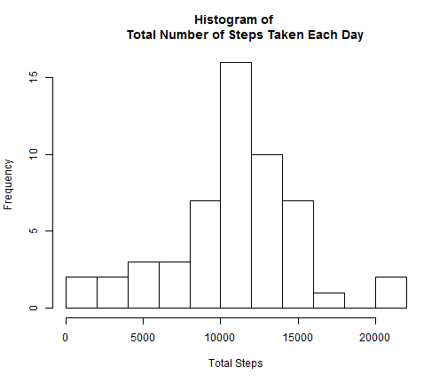
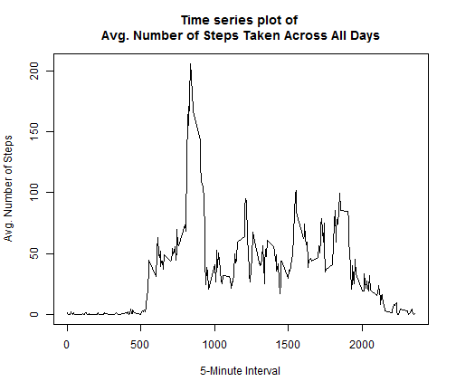
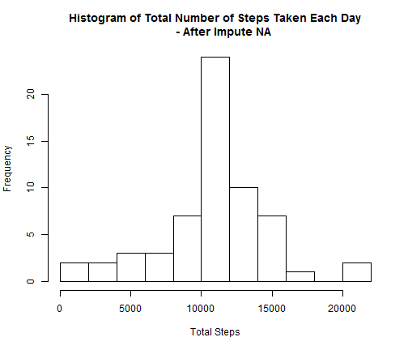
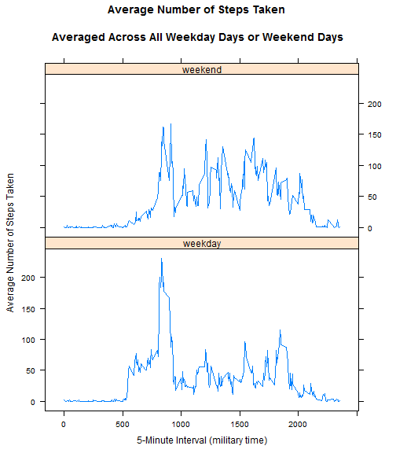

##Overview

The purpose of this assessment is to experience to create markdown document. 


##Loading and processing the data.
Download activity.zip file from web to current R working directory. Unzip file and load activity data while converting date column. 

```r
library("data.table")
library(plyr)

#get working directory
wd <- getwd() 
if (!file.exists("./data")) {dir.create("./data")}
wd <- paste(wd,"/data", sep="")

#download file
fileUrl <- "http://d396qusza40orc.cloudfront.net/repdata%2Fdata%2Factivity.zip"
fileName <- "activity.zip"

download.file(fileUrl, file.path(wd, fileName ),mode="wb")

#unzip file
unzip(file.path(wd, fileName), exdir = wd, overwrite=TRUE)

#read data
activity <- data.table(read.csv(file.path(wd, "activity.csv")))

#convert date to date data type
activity$date <- as.Date(activity$date) 
```


##What is mean total number of steps taken per day?

Calculate the total numbere of steps taken per day while omitting NA 

```r
#remove NA
activityNA <- na.omit(activity) 

#aggregate steps by date
activityDailyStepSum<-activityNA[,sum(steps), by = date]

#set column name
setnames(activityDailyStepSum , "V1", "TotalSteps")
```

Histogram of Total Number of Steps Taken Each Day

```r
#histogram 
hist(activityDailyStepSum$TotalSteps, 
     main="Histogram of 
     Total Number of Steps Taken Each Day",
     breaks=10,
     xlab="Total Steps")
```

 

Mean and median of the total number of steps taken per day

```r
mean(activityDailyStepSum$TotalSteps)    #mean
```

```
## [1] 10766.19
```

```r
median(activityDailyStepSum$TotalSteps)  #median
```

```
## [1] 10765
```

According to the data, average steps per day is 10,766. 

##What is the average daily activity pattern?
Time series plot of the 5-minute interval (x-axis) and the average number of steps taken, averaged across all days (y-axis)

```r
#calculate average step taken by 5-minutes interval
activityIntervalStepMean <- ddply(activityNA,~interval, summarise, mean=mean(steps))

#Time series plot
with(activityIntervalStepMean,plot(interval, mean, type="l",
      xlab="5-Minute Interval",
      ylab="Avg. Number of Steps",
      main="Time series plot of 
Avg. Number of Steps Taken Across All Days"
      ))
```

 

5-minute intervalwith the maximum number of steps?

```r
#max
activityIntervalStepMean[which.max(activityIntervalStepMean$mean), ]
```

```
##     interval     mean
## 104      835 206.1698
```

According to the data, person's daily activity peaks at 8:35 AM. 

##Imputing missing values
Total number of missing values in data set

```r
#count missing number
colSums(is.na(activity))
```

```
##    steps     date interval 
##     2304        0        0
```

Imputing missing data using mean of interval

```r
#merge activity and activityIntervalStepMean by Interval to get mean step per interval
activityMerged <- merge(activity, activityIntervalStepMean, by = "interval", all.x = TRUE)
#if step is null, use mean step per interval
activityMerged$newSteps = ifelse(is.na(activityMerged$steps), activityMerged$mean, activityMerged$steps)
```

Histogram of total number of steps taken each day using imputed step. 

```r
#Using imputed step, calculate daily total of steps
activityDailyStepSumImputed<-activityMerged[,sum(newSteps), by = date]
#set column name
setnames(activityDailyStepSumImputed , "V1", "TotalSteps")

#histogram
hist(activityDailyStepSumImputed$TotalSteps, 
     main="Histogram of Total Number of Steps Taken Each Day
     - After Impute NA",
     breaks=10,
     xlab="Total Steps")
```

 

New mean and median using imputed step. 

```r
mean(activityDailyStepSumImputed$TotalSteps)   #Mean
```

```
## [1] 10766.19
```

```r
median(activityDailyStepSumImputed$TotalSteps) #Median
```

```
## [1] 10766.19
```

##Are there differences in activity patterns between weekdays and weekends?

Add factor variable with two levels - weekday and weekend

```r
#Create factor variable - weekday
activityMerged$Weekday = 
  ifelse(weekdays(as.POSIXlt(activityMerged$date, format="%Y-%m-%d")) %in% c("토요일","일요일")
         ,"weekend", "weekday")
#create new dataset which has average of weekday and weekend per each interval
activityDayStepMean <- ddply(activityMerged,~interval+Weekday, summarise, mean=mean(newSteps))
```
Note: Since default language setting of PC is Korean, Weekdays() function returns day in Korean. 

Panel plot containing a time series plot of the 5-minute interval (x-axis) and the average number of steps taken, averaged across all weekday days or weekend days (y-axis).


```r
library("lattice")
#Panel plot 
p <- xyplot(mean ~ interval | factor(Weekday), data=activityDayStepMean, 
            type = 'l',
            main="Average Number of Steps Taken 
       \nAveraged Across All Weekday Days or Weekend Days",
            xlab="5-Minute Interval (military time)",
            ylab="Average Number of Steps Taken",
            layout=(c(1,2)))
print (p) 
```

 
